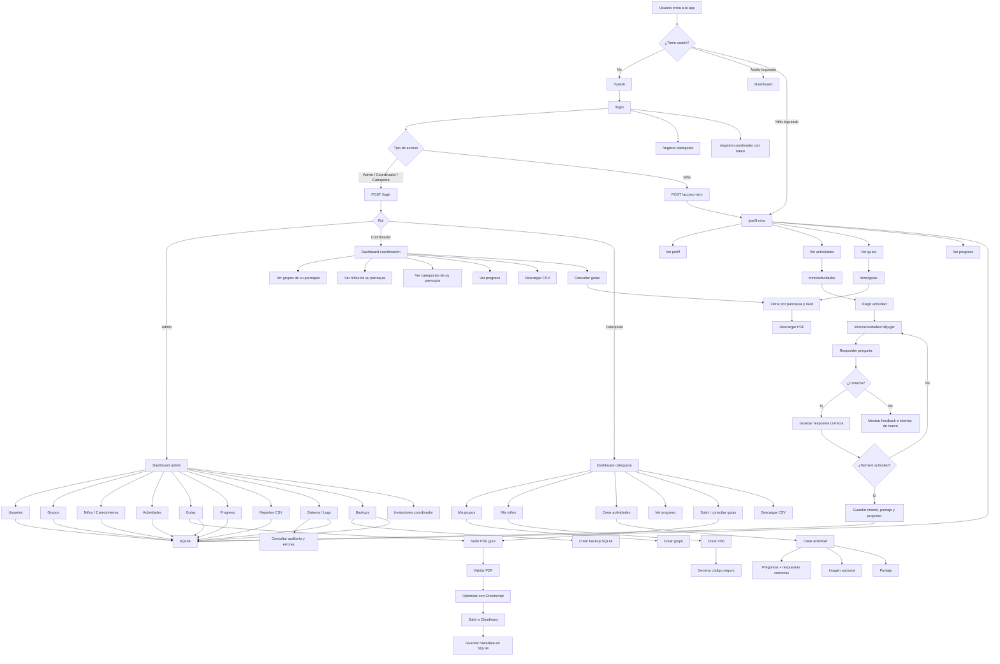

# Diagrama de flujo total — Catequesis San Pedro

```mermaid
flowchart TD
  A["Usuario entra a la app"] --> B{"¿Tiene sesión?"}

  B -->|No| C["/splash"]
  C --> D["/login"]

  B -->|Adulto logueado| E["/dashboard"]
  B -->|Niño logueado| N1["/perfil-nino"]

  D --> F{"Tipo de acceso"}

  F -->|Admin / Coordinador / Catequista| G["POST /login"]
  G --> H{"Rol"}

  H -->|Admin| AD["Dashboard admin"]
  H -->|Coordinador| CO["Dashboard coordinación"]
  H -->|Catequista| CA["Dashboard catequista"]

  F -->|Niño| N0["POST /acceso-nino"]
  N0 --> N1

  D --> RC["/registro-catequista"]
  D --> RI["/registro-coordinador con token"]

  AD --> AD1["Usuarios"]
  AD --> AD2["Grupos"]
  AD --> AD3["Niños / Catecúmenos"]
  AD --> AD4["Actividades"]
  AD --> AD5["Guías"]
  AD --> AD6["Progreso"]
  AD --> AD7["Reportes CSV"]
  AD --> AD8["Sistema / Logs"]
  AD --> AD9["Backups"]
  AD --> AD10["Invitaciones coordinador"]

  CO --> CO1["Ver grupos de su parroquia"]
  CO --> CO2["Ver niños de su parroquia"]
  CO --> CO3["Ver catequistas de su parroquia"]
  CO --> CO4["Ver progreso"]
  CO --> CO5["Descargar CSV"]
  CO --> CO6["Consultar guías"]

  CA --> CA1["Mis grupos"]
  CA --> CA2["Mis niños"]
  CA --> CA3["Crear actividades"]
  CA --> CA4["Ver progreso"]
  CA --> CA5["Subir / consultar guías"]
  CA --> CA6["Descargar CSV"]

  CA1 --> G1["Crear grupo"]
  CA2 --> CH1["Crear niño"]
  CH1 --> CH2["Generar código seguro"]
  CA3 --> AC1["Crear actividad"]
  AC1 --> AC2["Preguntas + respuestas correctas"]
  AC1 --> AC3["Imagen opcional"]
  AC1 --> AC4["Puntaje"]

  N1 --> N2["Ver perfil"]
  N1 --> N3["Ver actividades"]
  N1 --> N4["Ver guías"]
  N1 --> N5["Ver progreso"]

  N3 --> J1["/nino/actividades"]
  J1 --> J2["Elegir actividad"]
  J2 --> J3["/nino/actividades/:id/jugar"]
  J3 --> J4["Responder pregunta"]
  J4 --> J5{"¿Correcta?"}
  J5 -->|Sí| J6["Guardar respuesta correcta"]
  J5 -->|No| J7["Mostrar feedback e intentar de nuevo"]
  J6 --> J8{"¿Terminó actividad?"}
  J8 -->|No| J3
  J8 -->|Sí| J9["Guardar intento, puntaje y progreso"]

  N4 --> GU1["/nino/guias"]
  GU1 --> GU2["Filtrar por parroquia y nivel"]
  GU2 --> GU3["Descargar PDF"]

  AD5 --> GUA["Subir PDF guía"]
  CA5 --> GUA
  CO6 --> GU2

  GUA --> GUB["Validar PDF"]
  GUB --> GUC["Optimizar con Ghostscript"]
  GUC --> GUD["Subir a Cloudinary"]
  GUD --> GUE["Guardar metadata en SQLite"]

  AD9 --> BK1["Crear backup SQLite"]
  AD8 --> LG1["Consultar auditoría y errores"]

  AD1 --> DB["SQLite"]
  AD2 --> DB
  AD3 --> DB
  AD4 --> DB
  AD5 --> DB
  AD6 --> DB
  AD7 --> DB
  AD8 --> DB
  AD9 --> DB
  N1 --> DB
  J9 --> DB
```
